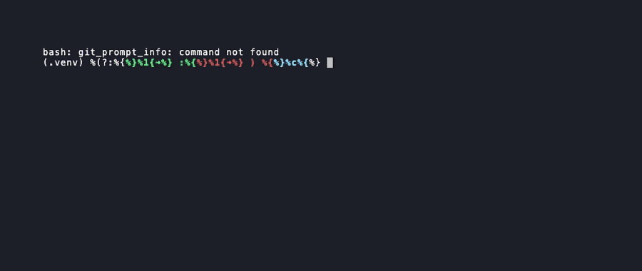

# SWIFT — AI-Powered Red-Team Automation Platform

> Continuous intelligence → active probes → credential-chained attacks → post-exploit assessment. Fully sandboxed. ROE-gated. AI-driven.

[](https://github.com/jellaharshith/SWIFT/actions/workflows/ci.yml)
[](https://pypi.org/project/swiftsec/)
[](https://www.python.org/)
[](LICENSE)



> **New here?** Start with the [Quickstart Guide →](docs/QUICKSTART.md)

---

## Table of Contents

- [Overview](#overview)
- [Architecture](#architecture)
- [Features](#features)
- [Requirements](#requirements)
- [Installation](#installation)
- [Quick Start](#quick-start)
- [Rules of Engagement](#rules-of-engagement)
- [Commands](#commands)
- [Configuration](#configuration)
- [Plugin SDK](#plugin-sdk)
- [CI/CD Integration](#cicd-integration)
- [Safety & Legal](#safety--legal)
- [Contributing](#contributing)
- [Security](#security)
- [License](#license)

---

## Overview

SWIFT is a professional-grade, AI-powered red-team automation platform built for authorized penetration testing engagements. It orchestrates a full offensive pipeline — from passive OSINT through active exploitation and post-exploit simulation — using Claude Sonnet as the reasoning engine and a continuously updated RAG knowledge base.

**Who it is for:** Penetration testers, security engineers, and red teams conducting authorized engagements against owned or explicitly scoped targets.

**What makes it different:**
- **Continuous intelligence** — 10-source RAG knowledge base (MITRE ATT&CK, ExploitDB, HackerOne, Nuclei, OWASP) auto-synced nightly
- **Agentic loop** — Claude Sonnet autonomously selects probes, chains findings, and adjusts strategy without operator intervention
- **Hard ROE enforcement** — every offensive command is scope-, technique-, and time-window-gated before execution
- **CISSP/OSCP-grade output** — findings reported with MITRE ATT&CK mapping, CVSSv3 scoring, and executive-ready narrative

---

## Architecture

```
┌─────────────────────────────────────────────────────────────┐
│                        SWIFT Platform                       │
├──────────────────┬──────────────────┬───────────────────────┤
│  Intelligence    │   Attack Engine  │    Reporting Layer    │
│  ─────────────   │   ────────────   │    ───────────────    │
│  ChromaDB RAG    │   26 Probe Types │    SARIF / JSON / MD  │
│  10-source sync  │   Kali Runners   │    Audit Hash Chain   │
│  Payload Mutator │   Agentic Loop   │    CISSP-voice Narr.  │
└──────────────────┴──────────────────┴───────────────────────┘
         │                  │                    │
         ▼                  ▼                    ▼
   Claude Sonnet      Docker Sandbox       Engagement Log
   (tool-use loop)   (network=none)     (SHA-256 chained)
```

**Full architecture reference:** [`docs/README.md`](docs/README.md)

---

## Features

### Intelligence Engine

SWIFT maintains a live knowledge base synced from 10 sources: MITRE ATT&CK, ExploitDB, GitHub Security Advisories, Nuclei templates, PayloadsAllTheThings, SecLists, HackerOne disclosed reports, OWASP WSTG, security blogs (PortSwigger, NCC, Project Zero, Assetnote), and Snyk VulnDB. Every probe invocation is RAG-enriched with fresh payloads before firing.

| Component | Technology | Function |
|-----------|-----------|---------|
| Intel Sync | 10 external sources | Nightly or on-demand knowledge base refresh |
| RAG Retrieval | ChromaDB + all-MiniLM-L6-v2 | Semantic payload injection into Sonnet prompts |
| Payload Mutation | LLMPayloadMutator + Claude Haiku | WAF-bypass variants per target tech stack |
| Confidence Calibration | sklearn LogisticRegression | OOB-confirmed=keep · keyword-only=×0.7 · multi-signal=×1.1 |

### Active Probe Coverage (26 Types)

**Web & API:** XSS · SQLi · SSRF · OOB SSRF · SSTI · IDOR · JWT alg:none · XXE · CRLF · NoSQL · Prototype Pollution · Auth Bypass · HTTP Smuggling · GraphQL · Race Condition · API Key Discovery · DOM IDOR · OAuth/OIDC · WebSocket · Business Logic

**Extended:** Cloud SSRF (AWS/GCP/Azure IMDS) · Supply Chain (dependency confusion) · Credential Breach (HIBP) · Kerberoasting · Mobile Hardcoded Secrets · Network Service CVE

### Extended Attack Modules

| Probe | Targets | Required ROE |
|-------|---------|-------------|
| Cloud SSRF | AWS IMDS (v4/v6), GCP, Azure metadata | `active_scan` |
| Supply Chain | PyPI/NPM dependency confusion, typosquatting | `osint` |
| Credential Breach | HIBP k-anonymity check on discovered emails | `osint` |
| Mobile Static | APK decompile → API key/endpoint grep | `active_scan` |
| Active Directory | LDAP enumeration, Kerberoasting (Impacket) | `exploit` |
| Network Service | nmap → NVD CVE lookup → ExploitDB PoC | `active_scan` |

### Kali Tool Integration

Docker-isolated runners for professional-grade offensive tooling, all ROE-gated and WAF-evasion aware:

| Tool | MITRE Technique | Purpose |
|------|----------------|---------|
| impacket-scripts | T1550.001 | Kerberoasting, LDAP enumeration |
| metasploit-framework | T1587.004 | Module exploitation (simulate-only default) |
| crackmapexec | T1021.002 | SMB/WinRM/LDAP/MSSQL enumeration |
| openvas | T1046 | GMP XML API, CVSSv3 scoring |
| semgrep-rules | T1526 | SAST across Python/JS/Java/Go/Ruby/PHP |
| nmap | T1046 | Service version fingerprinting |
| nuclei | T1190 | Template-based vulnerability scanning |
| sqlmap | T1190 | SQL injection with WAF-bypass tampers |

### AI Enhancement Layer

| Component | Model | Role |
|-----------|-------|------|
| MultiModelClient | Claude → GPT-4o → Gemini | Automatic fallback on rate limits |
| Attack Graph Reasoner | Claude Sonnet (tool-use) | MITRE ATT&CK-mapped exploit chain planning |
| LLMPayloadMutator | Claude Haiku | Bulk WAF-bypass payload generation |
| ConfidenceCalibrator | sklearn | Signal-weighted finding scoring |

### Agentic Red-Team Loop

`RedTeamAgent` runs Claude Sonnet in an autonomous tool-use loop — selecting probes, forming hypotheses, chaining findings, and adjusting strategy without operator input.

- **Plateau detection** — stops when 5 consecutive iterations return no new findings
- **Budget gates** — configurable probe and Sonnet call limits prevent runaway spend
- **Context compression** — automatic at 20+ turns to stay within model context
- **Full audit trail** — every iteration logged with hash-chain integrity

### Credential Chaining

`SessionManager` propagates session artifacts (cookies, JWTs, API tokens) across the full engagement pipeline:

```
SQLi → leaked credential → form login → JWT captured → IDOR as victim → privilege escalation
```

### Immutable Audit Log

Every engagement produces a SHA-256 hash-chained JSONL log. Any tampered entry is immediately detectable via `audit verify`. Credentials are automatically redacted. Optional GPG manifest signing for legal-grade evidence.

---

## Requirements

| Requirement | Version |
|------------|---------|
| Python | 3.10+ |
| Docker | 20.10+ (for Kali runners and sandbox) |
| Anthropic API key | Required |

Optional: `GITHUB_TOKEN`, `SHODAN_API_KEY`, `NVD_API_KEY` for full OSINT coverage.

---

## Installation

```bash
pip install swiftsec
```

Or install from source:

```bash
git clone https://github.com/jellaharshith/SWIFT.git
cd SWIFT
pip install -e .
```

---

## Quick Start

```bash
# Set required API key
export ANTHROPIC_API_KEY=sk-ant-...

# Copy and configure your Rules of Engagement file (required for offensive commands)
cp roe.example.yaml roe.yaml
# Edit roe.yaml: set authorized_targets, window dates, contact

# Full red-team pipeline (OSINT → niche classification → active probes → chain → post-exploit)
swiftsec redteam --roe roe.yaml --target https://your-authorized-target.com

# Autonomous agentic mode — Sonnet drives the full engagement
swiftsec redteam --roe roe.yaml --target https://your-authorized-target.com --agentic

# Watch live agentic progress
swiftsec agent-status

# Include static code analysis
swiftsec redteam --roe roe.yaml --target https://your-authorized-target.com --repo ./my-app

# OSINT reconnaissance only
swiftsec osint --roe roe.yaml --out osint.json

# Classify attack niches for a target
swiftsec niche example.com

# Static code scan
swiftsec scan ./my-project

# Kali tool suite scan
swiftsec kali-scan --target 10.0.0.1 --tools nmap,nikto,nuclei,ffuf

# Active web probe
swiftsec web-scan --target https://your-authorized-target.com --yes

# Sync intelligence knowledge base
swiftsec intel sync
swiftsec intel search "SQL injection WAF bypass" --n 10
swiftsec intel status

# Manage custom payloads
swiftsec payload add ./my-payloads.txt --vuln-type xss
swiftsec payload list
swiftsec payload remove --vuln-type xss --payload "<script>alert(1)</script>"

# Execute a validated attack chain (sandbox only)
swiftsec chain --execute CHAIN-001 --roe roe.yaml

# Verify audit log integrity
swiftsec audit verify --log ~/.swift/engagements/<id>/audit.jsonl

# Export engagement report
swiftsec audit export --log ~/.swift/engagements/<id>/audit.jsonl --out report.md

# Manage custom probe plugins
swiftsec plugin list
swiftsec plugin install ./my_probe/
swiftsec plugin validate ./my_probe/

# Interactive wizard
swiftsec wizard
```

---

## Rules of Engagement

All offensive commands (`redteam`, `osint`, `chain`) require a signed Rules-of-Engagement YAML. SWIFT validates scope, technique permissions, and time window before any work begins.

```yaml
# roe.yaml
engagement_id: "ENG-001"
authorized_targets:
  - "https://target.example.com"
allowed_techniques:
  - osint
  - active_scan
  - exploit
  - post_exploit
  - oob_ssrf
  - oauth_attack
  - websocket_attack
  - bizlogic
  - agentic_loop
window_start: "2026-01-01T00:00:00"
window_end:   "2026-12-31T23:59:59"
contact:      "you@yourorg.com"
simulate_only: true
allow_chain_execution: false   # set true only for Juice Shop / DVWA targets
```

**SWIFT hard fails** (`[DENY]` + exit code 2) when:

- ROE file is absent or invalid
- Target is not in `authorized_targets`
- Requested technique is not in `allowed_techniques`
- Current time is outside `window_start` / `window_end`

---

## Commands

### Global Flags

| Flag | Environment Variable | Effect |
|------|---------------------|--------|
| `--version` | — | Print version and exit |
| `--yes` / `-y` | `SWIFT_AUTO_CONFIRM=1` | Skip interactive consent prompts |
| `--no-banner` | `SWIFT_NO_BANNER=1` | Suppress ASCII banner |
| `--quiet` / `-q` | — | Minimal output |
| `--log-file PATH` | — | Override step log path |

### Command Reference

| Command | ROE Required | Description |
|---------|:-----------:|-------------|
| `redteam` | ✅ | Full pipeline: all phases |
| `redteam --agentic` | ✅ | Autonomous Claude Sonnet–driven engagement |
| `agent-status` | — | Live agentic loop progress |
| `osint` | ✅ | 10-source passive reconnaissance |
| `niche <target>` | — | OSINT → attack niche classification |
| `scan` | — | Static codebase analysis |
| `triage` | — | Alias for `scan` |
| `report` | — | Generate report from prior scan artifacts |
| `full-scan` | — | Code + Kali tools + CVE correlation |
| `kali-scan` | — | Kali tool suite only |
| `web-scan` | — | Playwright-driven active web probe |
| `payload add\|list\|remove` | — | Manage custom payload library |
| `chain --execute` | ✅ | Replay attack chain (sandbox only) |
| `audit verify` | — | Verify engagement log hash chain |
| `audit export` | — | Export engagement report |
| `intel sync\|search\|status\|version` | — | Manage intelligence knowledge base |
| `plugin list\|install\|remove\|validate` | — | Manage custom probe modules |
| `attack-sim` | — | MITRE-mapped Kali simulation |
| `live-feed` | — | NVD + CISA KEV threat stream |
| `privesc` | — | Docker privilege escalation check (`--allow-privesc` required) |
| `wizard` | — | Interactive engagement wizard |

---

## Configuration

```bash
cp swift/.env.example .env
```

### Core

| Variable | Required | Description |
|----------|:--------:|-------------|
| `ANTHROPIC_API_KEY` | ✅ | Claude API key |

### OSINT & Reconnaissance

| Variable | Description |
|----------|-------------|
| `GITHUB_TOKEN` | GitHub dork search + GitHub Security Advisory sync |
| `SHODAN_API_KEY` | Shodan intelligence |
| `NVD_API_KEY` | NVD CVE feed (higher rate limit) |
| `HUNTER_API_KEY` | hunter.io email enumeration |

### Intelligence Engine

| Variable | Default | Description |
|----------|---------|-------------|
| `INTEL_DB_PATH` | `~/.swift/intel/chromadb` | ChromaDB storage path |
| `INTEL_SYNC_INTERVAL_HOURS` | `24` | Auto-sync frequency |
| `SWIFT_INTEL_AUTO_SYNC` | — | Set `1` for background sync on every scan |
| `OPENAI_API_KEY` | — | GPT-4o fallback model |
| `GEMINI_API_KEY` | — | Gemini fallback model |
| `HIBP_API_KEY` | — | Have I Been Pwned v3 API (credential breach probe) |

### Offensive Operations & Chains

| Variable | Description |
|----------|-------------|
| `SWIFT_ROE` | Default ROE file path |
| `INTERACTSH_URL` | Route OOB SSRF callbacks through Interactsh |
| `SWIFT_GPG_KEY_ID` | GPG key ID for engagement manifest signing |
| `SWIFT_AGENT_BUDGET_PROBES` | Max probe calls per agentic engagement |
| `SWIFT_AGENT_BUDGET_SONNET_CALLS` | Max Sonnet calls per agentic engagement |

---

## Plugin SDK

Write custom probes in ~50 lines by extending `BaseModule`:

```python
from sdk.base import BaseModule, Finding, Phase, VulnType, Severity
from sdk.decorators import roe_gated

class MyProbe(BaseModule):
    name = "my_probe"
    phase = Phase.ACTIVE
    vuln_types = [VulnType.SSRF]

    @roe_gated("active_scan")
    async def probe(self, target, session, roe) -> list[Finding]:
        ...
```

Install and auto-discover:

```bash
swiftsec plugin install ./my_probe/
swiftsec plugin validate ./my_probe/
```

Available decorators: `@roe_gated`, `@cached_result`, `@retry`. Test harness: `SwiftTestHarness` with `MockSessionManager`.

**Full tutorial:** [`docs/sdk/WRITING_A_MODULE.md`](swift/docs/sdk/WRITING_A_MODULE.md)

---

## CI/CD Integration

SWIFT is pipe-safe: the banner writes to stderr, findings to stdout.

```yaml
# GitHub Actions example
- name: SWIFT static code scan
  run: swiftsec scan . --output json > swift-report.json
  env:
    ANTHROPIC_API_KEY: ${{ secrets.ANTHROPIC_API_KEY }}
    SWIFT_NO_BANNER: "1"
```

```bash
# Filter CRITICAL findings
swiftsec scan ./repo | jq '.findings[] | select(.severity == "CRITICAL")'
```

---

## Safety & Legal

**SWIFT is authorized-use-only software.**

> Use of SWIFT against systems you do not own or have explicit written authorization to test is illegal and unethical. The authors accept no liability for unauthorized use.

SWIFT enforces safety at the platform level:

| Control | Implementation |
|---------|---------------|
| ROE gate | Hard fail-closed on scope, technique, and time-window violations |
| Docker sandbox | All offensive operations run in ephemeral containers (`--network=none`, read-only FS, 2-core / 2 GB / 30 s limit) |
| Chain execution guard | `allow_chain_execution: true` required in ROE; only effective against Juice Shop / DVWA |
| Post-exploit simulation | Simulate-only by default and enforced by ROE; no real data exfiltration |
| Agentic budget gates | Configurable probe and API call limits prevent runaway spend |
| Audit log integrity | SHA-256 hash-chained log — tampered entries detected on `audit verify` |
| Confidence threshold | Only findings with ≥ 95% confidence are reported |
| Credential redaction | Bearer tokens, API keys, and passwords are automatically redacted from all logs |

---

## Contributing

See [`CONTRIBUTING.md`](CONTRIBUTING.md) for development setup, coding standards, and the pull request process.

```bash
# Run the test suite
pytest test/ -v --cov
```

---

## Security

For responsible disclosure of vulnerabilities in SWIFT itself, see [`SECURITY.md`](SECURITY.md).

---

## License

MIT — see [`LICENSE`](LICENSE).
